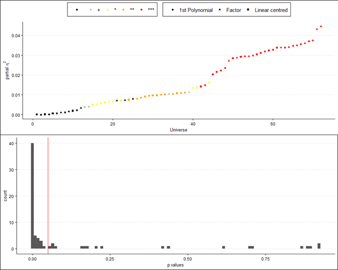

```{r setup, include=FALSE}
# Presentazione preparata da Michele Scandola per il seminario
# dell'Italian Reproducibility Network all'Università di Verona
# del 1^ febbraio 2023 aggiornata al 16 marzo 2023
# 
# Licenza afl-3.0

library(fontawesome)
library(knitr)
library(afex)
library(reshape2)
library(ggplot2)
library(gridExtra)
knitr::opts_chunk$set(echo = FALSE)

GimmeStar <- function(p, not_trend = FALSE){
  if (is.na(p)) {warning("presence of NAs");return("")}
  if (p>0.10) return("")
  if (p>0.05 & !not_trend) return("+")
  if (p>0.01) return("*")
  if (p>0.001) return("**")
  else return("***")
}
```

::: center
<iframe width="560" height="315" src="https://www.youtube.com/embed/NRDmvpLEzws?start=756" title="YouTube video player" frameborder="0" allow="accelerometer; autoplay; clipboard-write; encrypted-media; gyroscope; picture-in-picture; web-share" allowfullscreen></iframe>
:::

## Table of topics

<p class="top-three">

> 1.  Researcher's degrees of freedom <br>
> 2.  An example of Researcher's dof <br>
> 3.  What is a multiverse analysis? <br>
> 4.  Applying a multiverse analysis <br>
> 5.  Examples in published research

</p>

## Torturing the data

::: center

:::

## Your model is wrong

::: center

:::

## 

<p class="top-three">

> 1.  **Researcher's degrees of freedom** <br>
> 2.  An example of Researcher's dof <br>
> 3.  What is a multiverse analysis? <br>
> 4.  Applying a multiverse analysis <br>
> 5.  Examples in published research

</p>

## Researcher's degrees of freedom

-   different approaches in data-handling

-   different choices in statistical testing

-   different interpretations

-   *Are these differences really harmful?*

-   {width="700"}<br>[@simmons2016false]

<blockquote>

-   There is a growing realization that statistically significant claims in scientific publications are routinely mistaken. [@gelman2013garden]

</blockquote>

## Researcher's degrees of freedom

In analysing our data, we can follow one among<br>four main approaches [@gelman2013garden]:

1.  `r fa("hourglass", fill = "grey")` Applying a unique statistical test on data.
2.  `r fa("medal", fill = "green")` Applying a pre-registered statistical test on data, pre-specifying all choices.
3.  `r fa("triangle-exclamation", fill = "orange")` Applying a statistical test on data, that would be different given a different data set (**Researcher's dof**)
4.  `r fa("skull-crossbones", fill = "red")` Applying all possible choices in data handling and statistical tests (the so-called **fishing**) 

## Researcher's degrees of freedom

-   Data are not passively collected and analysed.
-   Removing outliers, transforming variables, choosing<br>independent variables and confounders are routine decisions for researchers.
-   From a single data set, we can have multiple processed data sets.
-   Researchers select a single (or a few) data processing choices and then present this as the only analysis that ever would have been done.
-   The inevitable arbitrariness in the data and the sensitivity of the result is hidden to the reader.

[@steegen2016increasing]

## Researcher's degrees of freedom

::: center
{width="1000"}<br>[@simonsohn2020specification]
:::

## 

<p class="top-three">

> 1.  ~~Researcher's degrees of freedom~~ <br>
> 2.  **An example of Researcher's dof** <br>
> 3.  What is a multiverse analysis? <br>
> 4.  Applying a multiverse analysis <br>
> 5.  Examples in published research

</p>

## An example of Researcher's dof

Let's imagine that we want to understand if we are able<br>to connect laterality cues to motor answers faster with the upper or the lower limbs.

Therefore, we prepared an experiment, where participants had to listen or read the words "Left" or "Right" (**cue**) and, as fast as they can, correctly press the corresponding button (in the "hands" **block**) or pedal (in the "feet" **block**).

Each cue was repeated 20 times per **block:cue** combination, and we collected data from 30 participants (half males, half females).

```{r}
## DATA GENERATION
## this dataset is generated to purposely
## simulate a "fishing" behaviour
## for this reason, data will be generated
## and accepted only if a key factor is not
## significant in two ANOVAs, while significant
## only in a third ANOVA.

n_block <- 2
n_cue   <- 2
n_subj  <- 30
n_item  <- 20

i <- 1

repeat{
  
  dat <- data.frame(
    block = gl(n_block, n_cue * n_subj * n_item,
               labels = c("Hands", "Feet")), 
    subj  = rep(1:n_subj, 
                length = n_cue * n_block * n_item * n_subj),
    cue   = gl(n_cue, n_subj,
               labels = c("L", "R"),
               length = n_cue * n_block * n_item * n_subj)
  )
  
  set.seed(i)
  
  dat$RT <- rnorm(
    mean = 1.5 + ifelse(dat$block == "Feet", 0.08, 0),
    n = n_cue * n_block * n_item * n_subj
  ) +
    rexp(
      n = n_cue * n_block * n_item * n_subj
    )
  
  dat$correct <- rbinom(
    n = n_cue * n_block * n_item * n_subj,
    prob = 0.95,
    size = 1)
  
  dat$sex <- factor( ifelse(
    dat$subj < 11, "F", "M"
  ) )
  
  dat$RT <- ifelse(dat$RT <= 0, abs(dat$RT) + 0.1, dat$RT)
  
  ## apply constrains for fishing simulation
  tmp_dat <- droplevels(
    dat[dat$correct == 1,]
  )
  
  tmp_dat$y <- log(tmp_dat$RT)
  
  out <- boxplot.stats(
    tmp_dat$y
  )$out
        
  tmp_dat <- droplevels(
    tmp_dat[-which(tmp_dat$y %in% out),]
  )
  
  mdl1 <- aov_4( y ~ block * cue + sex+
                   (block * cue | subj),
                 data = tmp_dat,
                 fun_aggregate = mean)
  
  mdl2 <- aov_4( y ~ block * cue +
                   (block * cue | subj),
                 data = tmp_dat,
                 fun_aggregate = mean)
  
  mdl3 <- aov_4( y ~ block+
                   (block | subj),
                 data = tmp_dat,
                 fun_aggregate = mean)
  if(
    mdl1$anova_table$`Pr(>F)`[2] < 0.05 &
    mdl2$anova_table$`Pr(>F)`[1] > 0.05 &
    mdl3$anova_table$`Pr(>F)`[1] > 0.05
  )  break(   )
  i <- i + 1
}
```

```{r}
inputPanel(
  ## the data was actually generated before-hand
  actionButton("generate_button",
               label = "Generate the data.",
               class = "btn-success")
)

renderPlot({
    if( (input$generate_button) != 0 ){
      hist(dat$RT)
    }
  }
)

renderDataTable({
    if( (input$generate_button) != 0 ){
      dat
    }
  }
)
```

## An example of Researcher's dof `r fa("fish", fill = "grey")`

Research question: Are we faster in connecting laterality cues to<br>motor answers with the upper or the lower limbs?

```{r}
inputPanel(
    radioButtons("rb_trans",
               "Do you want to apply a transformation to the reaction times?",
               choiceNames = 
                 list(
                   "Raw RT", 
                   "log(RT)", 
                   "sqrt(RT)"
                   ),
               choiceValues =
                 list(
                   "Raw RT", 
                   "log(RT)", 
                   "sqrt(RT)"
                   )
               ),
  

  radioButtons("rb_correct",
               "Do you want to consider only correct responses?",
               choiceNames = list("Yes", "No"),
               choiceValues = list(TRUE, FALSE)),
      
  radioButtons("rb_outliers",
               "How do you want to remove outliers?",
               choiceNames = list("Boxplot rule", "Gaussian rule"),
               choiceValues = list(TRUE, FALSE)),
  
  checkboxGroupInput("cb_factors",
                     "Which independent variables do you want to consider?",
                     c("Block factor (Hands/Feet)" = "fct_block",
                       "Cue factor (Left/Right)" = "fct_cue",
                       "Sex factor (M/F)" = "fct_sex")),
  
  radioButtons("rb_analysis",
               "Do you want to execute an ANOVA, or a glm on a Gamma distribution?",
               choiceNames = list("ANOVA", "GLM"),
               choiceValues = list(TRUE, FALSE)),
  
  actionButton("compute_button",
               label = "Compute the analysis.",
               class = "btn-success"),
  
  actionButton("secret_button",
               label = "Secret button.",
               icon = icon("user-ninja"))
)

sidebarLayout(
  mainPanel(
    renderText(
      if( (input$compute_button) != 0 ){
        f1 <- ifelse(
          sum( input$cb_factors == "fct_block") > 0,
          " + block", ""
          )
        f2 <- ifelse(
          sum( input$cb_factors == "fct_cue") > 0,
          " + cue", ""
          )
        f3 <- ifelse(
          sum( input$cb_factors == "fct_sex") > 0,
          " + sex", ""
          )
        f4 <- ifelse(
          sum( input$cb_factors == "fct_cue") > 0 &
            sum( input$cb_factors == "fct_block") > 0,
          " + block:cue", ""
          )
        
        r1 <- ifelse(
          sum( input$cb_factors == "fct_block") > 0,
          " + block", ""
          )
        r2 <- ifelse(
          sum( input$cb_factors == "fct_cue") > 0,
          " + cue", ""
          )
        r3 <- ifelse(
          sum( input$cb_factors == "fct_cue") > 0 &
            sum( input$cb_factors == "fct_block") > 0,
          " + block:cue", ""
          )
        
        form <- paste0("y ~ 1", f1, f2, f3, f4,
                 " + (1", r1, r2, r3, "| subj)"
                 )
        
        print(form)
      }
    ),
    
    renderTable({
      if( (input$compute_button) != 0 ){
        new_dat   <- dat
        new_dat$y <- new_dat$RT
        
        if(input$rb_trans == "log(RT)"){
          new_dat$y <- log(new_dat$y)
        }
        
        if(input$rb_trans == "sqrt(RT)"){
          new_dat$y <- sqrt(new_dat$y)
        }
        
        if(input$rb_correct){
          new_dat <- droplevels(
            new_dat[new_dat$correct == 1,]
          )
        }
        
        if(input$rb_outliers){
          out <- boxplot.stats(
            new_dat$y
          )$out
          
          new_dat <- droplevels(
            new_dat[-which(new_dat$y %in% out),]
          )
        } else {
          mm <- mean(new_dat$y)
          ss <- sd(new_dat$y)
          
          out <- which(
            new_dat$y < (mm - 2 * ss) |
              new_dat$y > (mm + 2 * ss)
          )
          
          new_dat <- droplevels(
            new_dat[-out,]
          )
        }
        
        f1 <- ifelse(
          sum( input$cb_factors == "fct_block") > 0,
          "+ block", ""
          )
        f2 <- ifelse(
          sum( input$cb_factors == "fct_cue") > 0,
          "+ cue", ""
          )
        f3 <- ifelse(
          sum( input$cb_factors == "fct_sex") > 0,
          "+ sex", ""
          )
        f4 <- ifelse(
          sum( input$cb_factors == "fct_cue") > 0 &
            sum( input$cb_factors == "fct_block") > 0,
          "+ block:cue", ""
          )
        
        r1 <- ifelse(
          sum( input$cb_factors == "fct_block") > 0,
          "+ block", ""
          )
        r2 <- ifelse(
          sum( input$cb_factors == "fct_cue") > 0,
          "+ cue", ""
          )
        r3 <- ifelse(
          sum( input$cb_factors == "fct_cue") > 0 &
            sum( input$cb_factors == "fct_block") > 0,
          "+ block:cue", ""
          )
        
        form <- paste0("y ~ 1", f1, f2, f3, f4,
                 " + (1", r1, r2, r3, "| subj)"
                 )
        
        if(input$rb_analysis){
          tab <- aov_4(
            formula = as.formula(form),
            data = new_dat
            )$anova_table
        } else {
          mdl <- glmer(
            formula = as.formula(form),
            family = "Gamma",
            data = new_dat
          )
          
          tab <- car::Anova(
            mdl, type = 3
          )
        }
        
        tab
      }
    }, rownames = TRUE
  )
  ),
  sidebarPanel(
    renderImage({
    if( (input$secret_button) != 0 ){
      list(src = 'sampei.jpg')
    }else list(src = "")
  }, deleteFile = FALSE)
  )
)
```

## 

<p class="top-three">

> 1.  ~~Researcher's degrees of freedom~~ <br>
> 2.  ~~An example of Researcher's dof~~ <br>
> 3.  **What is a multiverse analysis?** <br>
> 4.  Applying a multiverse analysis <br>
> 5.  Examples in published research

</p>

## What is a multiverse analysis?

1.  A method to increase the robustness of results:

<blockquote>

-   *[...]* the statistical result based on the single data set reflects only one possible outcome in a multiverse of possible outcomes. Without knowing which other statistical results could have reasonably been observed, it is impossible to evaluate the **robustness of the finding**. [@steegen2016increasing, p. 704]

</blockquote>

2.  A method to increase transparency:

<blockquote>

-   **Transparency** could be increased by performing, for each research question, the same analysis for all possible data sets, defined by the reasonable choices for data processing. [@steegen2016increasing, p. 704]

</blockquote>

3.  A method that does not indicate the correctness of each analysis:

<blockquote>

-   The multiverse analysis **does not provide any information about the correct option in each of these choices**. [@harder2020multiverse, p. 1]

</blockquote>

4.  A method that can help pre-registration for novel studies

<blockquote>

-   **In novel studies, preregistration can be difficult** because researchers often lack sufficient knowledge to be able to foresee how they should deal with all possible decisions that need to be made when analyzing the data. [@girardi2022, p. 5]

</blockquote>

5.  A method that takes into account only the reasonable choices for data processing:

<blockquote>

-   A multiverse analysis involves performing the analysis of interest across the whole set of data sets that arise from different **reasonable choices for data processing**. [@steegen2016increasing, p. 703]

</blockquote>

## What is a multiverse analysis?

### Specification Curve Analysis

A method to show the results from a multiverse analysis is the<br>**specification curve analysis** (SCV) [@simonsohn2020specification].

-   SCV visually summarise the results for all (or a large random subset thereof) 'reasonable specifications', by which we mean specifications that are (1) sensible tests of the research question, (2) expected to be statistically valid and (3) not redundant with other specifications in the set [@simonsohn2020specification, p. 1208]

-   SCV complements pre-registration, allowing researchers to pre-commit to running the entire set of specifications they consider valid, rather than only a small and arbitrary subset of them as they must currently do. **Researchers, in other words, could pre-register their specification curves.** [@simonsohn2020specification, p. 1208]

## What is a multiverse analysis?

### Specification Curve Analysis

1.  **Identify the set of specifications**.

-   enumerating all of the data analytic decisions necessary to map the scientific hypothesis or construct of interest onto a statistical hypothesis;
-   enumerating all the reasonable alternative ways a researcher may make those decisions;
-   generating the exhaustive combination of decisions, eliminating combinations that are invalid or redundant.

2.  **Estimate and describe results**.
3.  **Joint tests for inferential specification curve**

-   test on the median of estimated effects across all specifications.
-   test on the share of significant results
-   test on the z-scores associated with the obtained p-value

## What is a multiverse analysis?

### Specification Curve Analysis


## What is a multiverse analysis?

### Specification Curve Analysis



## 

<p class="top-three">

> 1.  ~~Researcher's degrees of freedom~~ <br>
> 2.  ~~An example of Researcher's dof~~ <br>
> 3.  ~~What is a multiverse analysis?~~ <br>
> 4.  **Applying a multiverse analysis** <br>
> 5.  Examples in published research

</p>

## Applying a multiverse analysis

In R there are specific packages, such as:

-   `specr`
-   `multiverse`
-   `boba`

## Applying a multiverse analysis

However, it is not so difficult to avoid these packages with a few for loops:

```{r, echo = TRUE, warning = FALSE, message = FALSE}
results <- list()

for(mdl in c("ANOVA", "GLM")){
  for(dv in c("Raw RT", "log(RT)", "sqrt(RT)")){
    for(iv in c("y ~ 1 + block + (block | subj)",
                "y ~ 1 + block * cue + (block * cue | subj)",
                "y ~ 1 + block * cue + sex + (block * cue | subj)")){
      for(correct in c(TRUE, FALSE)){
        for(outlier in c("boxplot", "gaussian")){
          ## let's take it back the original generated dataset
          new_dat <- dat
          
          new_dat$y <- new_dat$RT
          
          if(dv == "log(RT)"){
            new_dat$y <- log(new_dat$RT)
          } else if (dv == "sqrt(RT)"){
            new_dat$y <- sqrt(new_dat$RT)
          }
          
          if(correct){
            new_dat <- droplevels(
              new_dat[new_dat$correct == 1,]
            )
          }
          
          if(outlier == "boxplot"){
            out <- boxplot.stats(
              new_dat$y
            )$out
            
            if(length(out)> 0){
              new_dat <- droplevels(
                new_dat[-which(new_dat$y %in% out),]
              )
            }
          } else {
            mm <- mean(new_dat$y)
            ss <- sd(new_dat$y)
            
            out <- which(
              new_dat$y < (mm - 2 * ss) |
                new_dat$y > (mm + 2 * ss)
            )
            
            new_dat <- droplevels(
              new_dat[-out,]
            )
          }
          
          if(mdl == "ANOVA"){
            tab <- aov_4(
              formula = as.formula(iv),
              data = new_dat,
              fun_aggregate = mean
            )$anova_table
            
            aa <- summary(
              mixed(formula = as.formula(iv),
                data = new_dat
              )
            )$coefficients
            
            results[[paste(dv, iv, correct, outlier, mdl)]] <-
              data.frame(
                dv = dv,
                iv = iv,
                correct = ifelse(correct, "Only correct trials", "all trials"),
                outliers = outlier,
                analysis = mdl,
                p = tab["block","Pr(>F)"],
                est = aa["block1","Estimate"]
              )
          } else if(dv == "Raw RT") {
            mdl2 <- glmer(
              formula = as.formula(iv),
              family = "Gamma",
              data = new_dat
            )
            
            tab <- car::Anova(
              mdl2, type = 3
            )
            
            results[[paste(dv, iv, correct, outlier, mdl)]] <-
              data.frame(
                dv = dv,
                iv = iv,
                correct = ifelse(correct, "Only correct trials", "all trials"),
                outliers = outlier,
                analysis = mdl,
                p   = tab["block","Pr(>Chisq)"],
                est = fixef(mdl2)["block1"]
              )
          
          }
        }
      }
    }
  }
}

results <- do.call("rbind", results)
```

```{r}
graph <- results[order(results$est),]
  
graph$Universe <- 1:nrow(graph)
graph$sig <- as.factor(
  sapply(
    graph$p,
    GimmeStar
  )
)
    
graph$sig <- ordered(graph$sig, levels=c("", "+", "*", "**", "***"))

inputPanel(
  actionButton("show_button",
               label = "Show the Specification Curve Analysis",
               class = "btn-success")
)

renderPlot({
  if(input$show_button != 0){
    
    grid.arrange(
      ggplot(graph, mapping = aes(y = est, x = Universe,
                                colour = sig))+
        scale_colour_manual(
          values = c("black", "grey", "yellow", "orange", "red")
        )+
        theme_classic()+
        theme(legend.title = element_blank(), legend.position = "top",
              legend.direction = "horizontal")+
        geom_point()+
        ylab("Estimate of the block effect"),
    
      ggplot(graph, aes(x = p))+
        geom_histogram(bins = 100)+
        geom_vline(xintercept= 0.05, colour = "red")
    )
    }
  }
)

renderTable({
  if(input$show_button != 0){
    
    graph$sig <- ordered(graph$sig, levels=c("", "+", "*", "**", "***"))
    
    graph$yy <- paste0(round(graph$est, 2), graph$sig)
    
    dcast(graph, dv + iv ~ analysis + correct + outliers, value.var = "yy")
  }
})
```

## 

<p class="top-three">

> 1.  ~~Researcher's degrees of freedom~~ <br>
> 2.  ~~An example of Researcher's dof~~ <br>
> 3.  ~~What is a multiverse analysis?~~ <br>
> 4.  ~~Applying a multiverse analysis~~ <br>
> 5.  **Examples in published research**

</p>

## Examples in published research

This approach is not only limited to the neuroscientific/psychological field, indeed:

-   Software engineering *Diagnosing Software Faults Using Multiverse Analysis*<br> [@chatterjee2020diagnosing]

-   Machine Learning *Modeling the Machine Learning Multiverse* [@bell2022modeling]

-   Education *Exploring the multiverse of analytical decisions in scaling educational large-scale assessment data: A specification curve analysis for PISA 2018 mathematics data* [@robitzsch2022exploring]

-   Sociology *How Robust Are Social Structural Predictors of Carbon Dioxide Emissions? A Multiverse Analysis* [@theis2022robust]

-   Journalism *If You Have Choices, Why Not Choose (and Share) All of Them? A Multiverse Approach to Understanding News Engagement on Social Media* [@pipal2022if]

-   Multiverse meta-analysis! *Exploring the efficacy of psychological treatments for depression: a multiverse meta-analysis protocol* [@plessen2022exploring]

## Thank you for your attention!

Questions?

[`r fa(name = "github")` repository](https://github.com/michelescandola/multiverse_analysis) https://github.com/michelescandola/multiverse_analysis


## References
